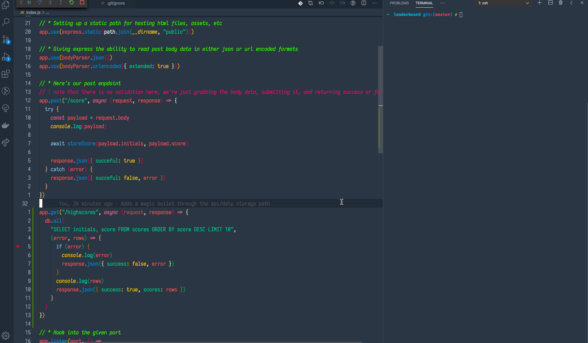

# Leaderboard

A really quick example using node/express/sqlite to make an API for storing leaderboard scores.


## Setup

```
git clone git@github.com:chris-schmitz/leaderboard-api.git
cd leaderboard-api
npm install
npm start
```

## AN IMPORTANT NOTE!!

This is a magic bullet example, i.e. just the steps we need to prove out the general form from start to finish. Because of this there's a lot of stuff not included like authroization, validation, a client example, etc.

In its current state this codebase is just an example.

## Submitting a score

Send a post request to the `score` endpoint with the following parameters

- initials (string)
- score (integer)

## Retrieving the high scores

To get the high scores you can do a get request to the `highscores` endpoint



## The data storage

We're using a sqlite database for this example and the database is not ignored in the codebase. Normally you'd want to ignore it, but it's part of this magic bullet proof of concept.

The database itself can be found in `database/leaderboard.db` and you can use the sqlite3 cli or a gui like TablePlus to explore it.
