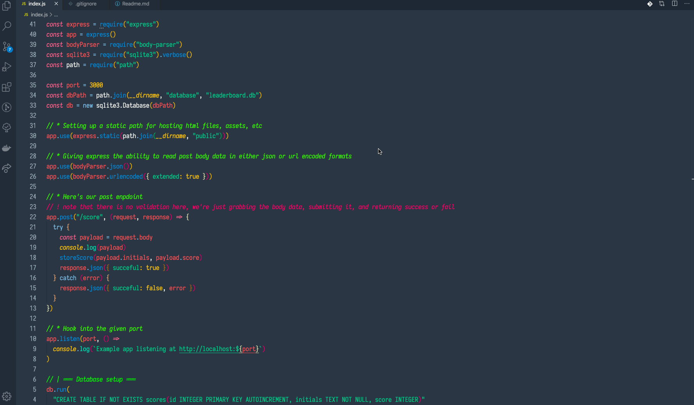

# Leaderboard

A really quick example using node/express/sqlite to make an API for storing leaderboard scores.



## Setup

```
git clone
cd leaderboard
npm install
npm start
``

## Submitting a score

Send a post request with the following parameters

- initials (string)
- score (integer)
```
